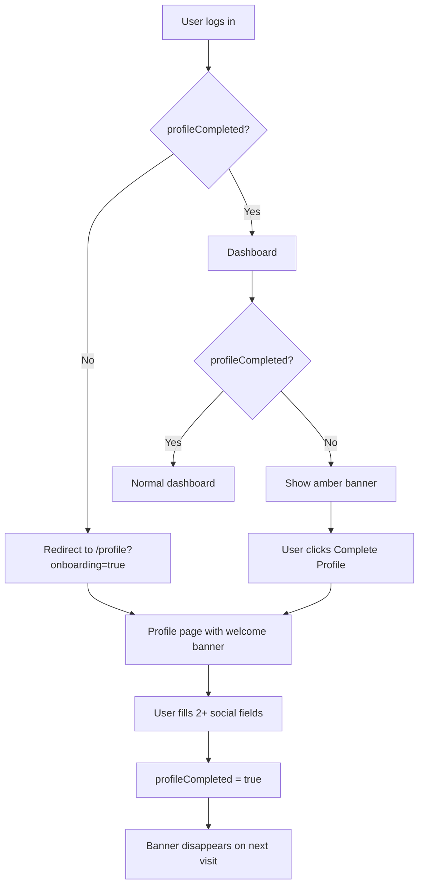

# Profile Completion Strategy - Walkthrough

## Summary

Implemented a multi-layered strategy to encourage users to complete their profiles with social network information after registration.

## Changes Made

### Database Schema

#### `src/models/user.ts`
- Added `profileCompleted: boolean` field to track profile completion status

---

### Authentication

#### `src/lib/auth.ts`
- Added `profileCompleted` to Session and User interfaces
- Propagates value through JWT and session callbacks

---

### API

#### `src/app/api/users/[id]/route.ts`
- Added automatic calculation of `profileCompleted` when profile is updated
- Profile is "complete" when **2+ social fields** are filled (linkedin, instagram, twitter, whatsapp, github)

---

### UI Components

#### [NEW] `src/components/layout/profile-completion-banner.tsx`
- Prominent amber banner with progress bar
- Shows completion percentage
- Dismissible per session
- CTA button to complete profile

#### [NEW] `src/components/layout/dashboard-content.tsx`
- Client wrapper that integrates the banner
- Uses redirect hook for first-time users

---

### Hooks

#### [NEW] `src/hooks/use-profile-completion-redirect.ts`
- Redirects users with incomplete profiles to `/profile?onboarding=true` on first visit
- Uses sessionStorage to prevent repeated redirects

---

### Pages

#### `src/app/(dashboard)/layout.tsx`
- Integrated `DashboardContent` wrapper with banner

#### `src/app/(dashboard)/profile/page.tsx`
- Added welcome onboarding banner for users redirected with `?onboarding=true`
- Blue gradient banner with instructions to complete profile

---

## User Flow

---

## Verification

✅ Build completed successfully with exit code 0
